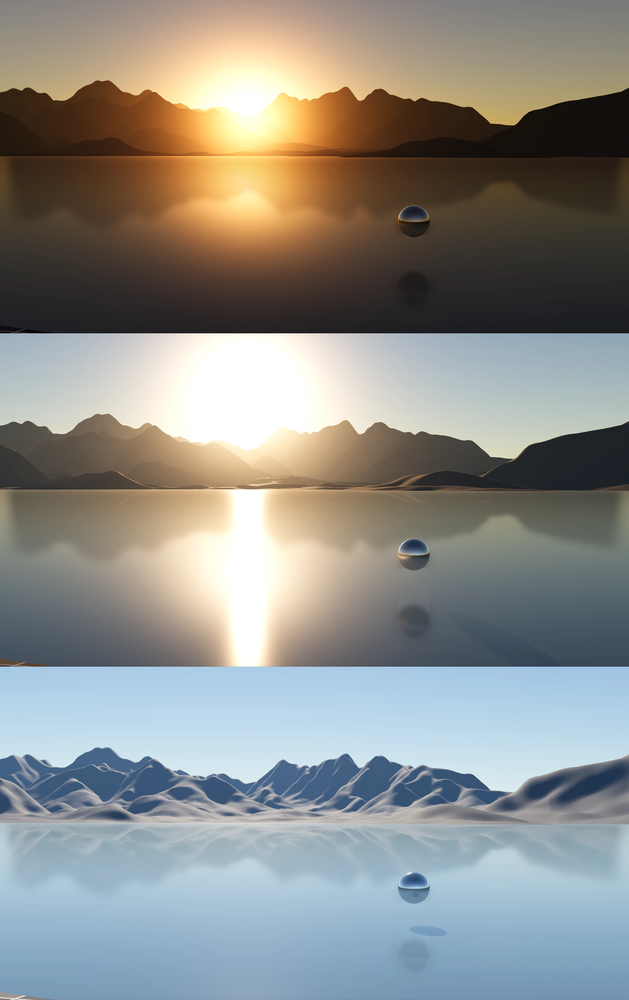

## Introduction

This demo implements physically based sky in Godot 4.5. The shaders are written in Slang Shading Language, precompiled to SPIRV for Godot to use. The project heavily uses Godot's Compositor feature.

I initially attempted to implement volumetric clouds, but encountered too many technical issues that stopped me from releasing it. So for now only the atmosphere part is provided.

It does not work for Godot version below 4.5 as it uses some 4.5 features.



## Porting Guide

This project is considered as an experimental demo, and I am by no means an expert of rendering. But if you like it, you are welcome to use it in your projects.

Godot does not support complex custom sky very well, I have had to take some workarounds to make it work, and using it is more than a simple drag-and-drop.

First, you need to copy `res://addons` to your project, and enable the two inside plugins, `eox_compute` and `eox_sky`, in the settings.

Create an empty `Node3D` scene. Create a `WorldEnvironment`, a `DirectionalLight3D` and an `EoxSky` node.

In `WorldEnvironment` create a `Compositor` resource, then add two `EoxComputeCompositorEffect` compositor effects. Change the first callback type to `Post Opaque`. An `EoxComputeCompositorEffect` does not do anything by itself, except for forwarding the callback through a signal.

Again in `WorldEnvironment` create an `Environment` resource. Change the `Source` property of `Ambient Light` and `Reflected Light` to `Sky`. Do NOT change the `Mode` property of `Background`, keep it as `Clear Color`. You may turn on the ACES tonemapping and SSR if you like. Add a `Sky` resource and change the `Process Mode` to `High-Quality Incremental`. Add a `ShaderMaterial` and assign `res://addons/eox_sky/gdshaders/sky_shader.gdshader` to it. Create a `Texture2DRD` to the the `Octmap` parameter of the material, which receives the rendered environment map.

In `EoxSky` create resources the four parameter classes: `Render Params`, `Planet Params`, `Sky Params`, `Atmos Params`.

Add a script to the root node, copy and paste the following code.

```gdscript
@tool
extends Node3D

func _ready() -> void:
  var sky: EoxSky = $EoxSky
  var world_env: WorldEnvironment = $WorldEnvironment
  var post_opaque_effect: EoxComputeCompositorEffect = world_env.compositor.compositor_effects[0]
  post_opaque_effect.callback.connect(sky.render_post_opaque)
  var post_trans_effect: EoxComputeCompositorEffect = world_env.compositor.compositor_effects[1]
  post_trans_effect.callback.connect(sky.render_post_transparent)
  _set_sky_material()

func _set_sky_material() -> void:
  var sky: EoxSky = $EoxSky
  var world_env: WorldEnvironment = $WorldEnvironment
  var sky_material: ShaderMaterial = world_env.environment.sky.sky_material
  var texture: Texture2DRD = sky_material.get_shader_parameter("_octmap")
  texture.texture_rd_rid = sky.get_sky_octmap_texture()

func _process(_delta: float) -> void:
  var sky: EoxSky = $EoxSky
  var sun: DirectionalLight3D = $DirectionalLight3D
  sun.basis = sky.get_sun_light_basis()
  sun.light_color = sky.get_sun_color()
  sun.light_energy = sky.get_sun_energy()
```

The script binds `EoxSky`'s rendering callbacks to the compositor effects, binds the environment texture, and drives the direction and color of the light.

Close and reopen the scene, you should be able to see the sky. If not, check the error messages.

You may change `Sun Altitude` and `Sun Azimuth` of `Render Params` to adjust the direction of the sun. You may change `Exposure Multiplier` to get a properly brightness.
Unfortunately, we are unable to read the camera exposure value from `RenderingServer` or `RenderingDevice`, so it has to be set manually.

`res://assets/landscape/hangzhou.gltf` is a 10km DEM-based landscape model. You may drop it to see if aerial perspective works. Remember to change editor's camera z-far distance to a large number, such as `50000.0`.

## Limitations

* Does not respect camera's exposure due to Godot's API.
* Atmosphere rendering does not support multiscattering.
* Atmosphere rendering does not support volumetric shadows.
* Does not support volumetric clouds.
* Environment map must be given through sky material.
* Sky may require debanding.
* Sky does not look right after sunset.
* No atmosphere below altitude < 0.
* Some hardcoded parameters.
* Ground color cannot be modified (parameters are not used)

## About Shaders

The shaders are written in Slang, not GLSL which Godot natively uses. Slang is chosen because it provides many modern language features that GLSL does not.
Although Godot cannot use Slang directly, it can use SPRIV compiled from Slang. Therefore, you do not need a Slang compiler in order to use these shaders, but you do need it if you want to modify the shader code and manually compile them after modification.

## License

The project is under MIT License.

